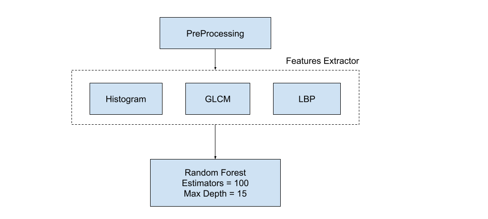

# Post-Flood Damages Classification

## Table of Contents

- [Introduction](#introduction)
- [Dataset](#dataset)
- [Classical Machine Learning Model Pipeline](#classical-machine-learning-model-pipeline)
  - [Data Preprocessing](#data-preprocessing)
  - [Feature Investigation](#feature-investigation)
    - [Color Histograms](#color-histograms)
    - [GLCM Features](#glcm-features)
    - [Local Binary Patterns (LBP)](#local-binary-patterns-lbp)
  - [Final Pipeline](#final-pipeline)
  - [Results](#results)
- [Deep Learning Model Pipeline](#deep-learning-model-pipeline)
  - [Transfer Learning](#transfer-learning)
  - [EfficientNet](#efficientnet)
  - [Training Scheme](#training-scheme)
  - [Training Logs](#training-logs)
  - [Results](#results-1)
- [Unsupervised Segmentation](#unsupervised-segmentation)
  - [Results](#results-2)

## Introduction

This project is the final project of the course "Satellite Imagery" at the University of Cairo, Faculty of Engineering Computer Department. The project is about classifying the damages of buildings that caused by a flood or not and segment the areas that got affected by floods. The project is divided into three main parts:

- Classical machine learning model pipeline.
- Deep learning model pipeline.
- Unsupervised Segmentation model pipeline.

## Dataset

The dataset consists of satellite imagery of different regions taken at different times. it contains 922 images of different sizes.

Multiple samples of the dataset:

## Classical Machine Learning Model Pipeline

### Data Preprocessing

- The images are resized to 256x256.
- Apply gamma correction to the images with gamma = 1.2 to enhance the contrast.

- Increase the saturation by transforming them to HSV
space and multiplying the hue channel by 1.5.

### Feature Investigation

#### Color Histograms

The first and simplest feature we can think of is the distribution of colors in the image. After analyzing the histograms we can see that the flooded images have a narrower histogram. So we created a feature vector containing 15 values for each RGB channel and used these vectors to train an SVM classifier and got the following results

| Accuracy | F1 Score |
| -------- | -------- |
| 84%      | 84%      |

#### GLCM Features

A statistical method of examining texture that considers the spatial relationship of pixels is the gray-level co-occurrence matrix (GLCM), also known as the gray-level spatial dependence matrix. The GLCM functions characterize the texture of an image by calculating how often pairs of pixels with specific values and in a specified spatial relationship occur in an image, creating a GLCM, and then extracting statistical measures from this matrix.

We used the GLCM features to train an Random Forest classifier and got the following results

| Accuracy | F1 Score |
| -------- | -------- |
| 83.7%    | 83.7%    |

#### Local Binary Patterns (LBP)

LBP features are histograms containing coarse gradient information from neighboring pixels surrounding each center pixel of an input image. Each feature captures statistical details regarding sequences of adjacent binary values derived from intensity transitions locally within neighborhood sizes ranging from 3x3 to 8x8. LBP constructs two types: uniform and directed, representing equal numbers of both positive and negative changes along horizontal and vertical directions.

We trained a random forest classifier on LBP features and got the following results

| Accuracy | F1 Score |
| -------- | -------- |
| 78%      | 78%      |

### Final Pipeline

### Results

|               | **Flooded** | **Non-Flooded** |
| ------------- | ----------- | --------------- |
| **Precision** | 0.88        | 0.89            |
| **Recall**    | 0.87        | 0.90            |
| **f1-score**  | 0.88        | 0.89            |
| **support**   | 87          | 98              |
| **Accuracy**  | 89%         |
| **macro avg** | 89%         |                 |

## Deep Learning Model Pipeline

After exploring classical approaches, we can find that our problem has a higher complexity than classical solutions so a good approach we can consider is the deep learning approach. But in order to train a CNN with a good performance we will need a lot of data that we don’t have, So in order to overcome this problem we used the following methods: Transfer Learning, Data Augmentation, and a CNN architecture called EfficientNet

### Transfer Learning

Refers to using pre-trained models to solve new tasks in deep learning. It enables fine-tuning an existing neural network model for a specific problem rather than training a new model from scratch. The pre-trained weights act as an initialization, providing a useful starting point and reducing the need for extensive data collection during training. By using transfer learning, practitioners can achieve better results faster and reduce computational costs, particularly for small datasets or complex problems.

### EfficientNet

EfficientNet is a state-of-the-art CNN architecture designed by Google Research that achieves high accuracy and efficiency across various resource configurations. This innovative approach addresses the trade-off between model complexity, parameters, and computational requirements by introducing novel modules and adaptive depths based on channel multipliers. By employing dynamic allocation schemes and progressively increasing resolutions throughout stages.

### Training Scheme

We divide the training process into two stages as follows:

|                          | **First Stage**     | **Second Stage**          |
| ------------------------ | ------------------- | ------------------------- |
| **Epochs**               | 15                  | 15                        |
| **Learning Rate**        | 1e-3                | 1e-4                      |
| **Trainable Parameters** | Top Classifier Only | From layer 220 in Network |
| **Callbacks**            | 87                  | Early stopping            |

### Training Logs

### Results

|               | **Flooded** | **Non-Flooded** |
| ------------- | ----------- | --------------- |
| **Precision** | 0.98        | 1.00            |
| **Recall**    | 1.00        | 0.98            |
| **f1-score**  | 0.99        | 0.99            |
| **support**   | 99          | 85              |
| **Accuracy**  | 99%         |                 |
| **macro avg** | 99%         |                 |

## Unsupervised Segmentation

For detecting flooded pixels we used K-means clustering as follows:

1. We transformed our image into hsv space
2. Calculating the average of the hue channel
3. If the average is going towards red color we swap red and blue RGB channels and recalculate the HSV channels (citation to Team 7 for this idea)
4. Cluster using k-means with k = 4
5. We consider the flooded cluster to have the following conditions:
   - Hue between 90 and 150
   - Saturation greater than 25 (to filter white color)

### Results

